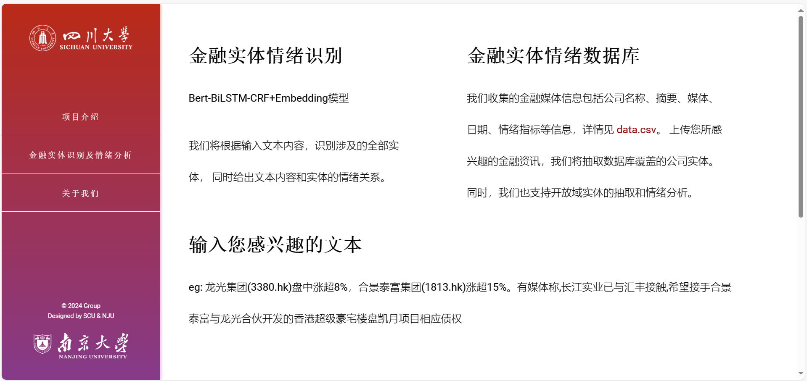
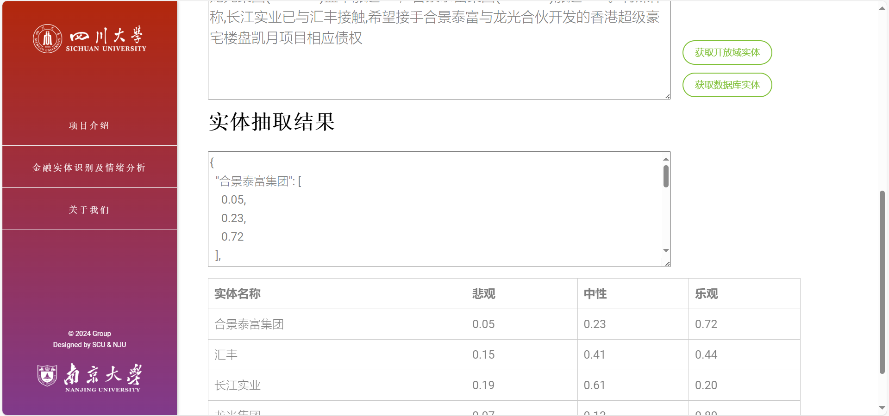

# BondSenti：基于BERT的债券违约情绪分析
### 0. 项目介绍

第19届“花旗杯”金融创新应用大赛参赛作品，以BERT模型为核心，组合实体抽取和消歧、情绪分析两个下游任务，抽取出非结构化文本中的债券实体和公司实体，并分别对相应实体进行对应文本的情绪分析，为债券违约提供参考，并将模型封装部署到了Web端。项目已经部署到：http://129.211.191.74/

### 1. 运行环境

本项目使用`python == 3.7.4`开发，主要使用到的库版本如下，详情见`requirements.txt`：

```
pytorch == 1.7.1 
pytorch-crf == 0.7.2  
pytorch-transformers == 1.2.0
numpy==1.21.6
pandas==1.3.5
Flask == 2.2.2 
```

### 2. 算法模型
- 实体识别模型：BERT(wwm)-BiLSTM-CRF 

- 实体消歧模型：Jaro-Winkler Distance

- 情绪分析模型：Cross Attention

### 3. 运行方式

3.1 安装`Python`环境

3.2 下载辅助文件（包含`bert-base-chinese`和`output`两个文件夹）：https://drive.google.com/file/d/1_nAdzbAfxV9ZydN0VXJv8wCtLhAIiCZN/view?usp=drive_link 解压后将这两个文件夹放到与项目**同级的目录**，具体结构如下：

```
- 项目根目录
  - Flask_Web
    - api.py
    - models.py
    - ...
  - bert-base-chinese
    - config.json
    - ...
  - output
  	- pytorch_model.bin
  	- ...
```

3.3 进入`Flask_Web`目录启动项目

```sh
python api.py
```


### 网页展示

项目介绍页面


金融实体识别及情绪分析页面






关于我们页面


